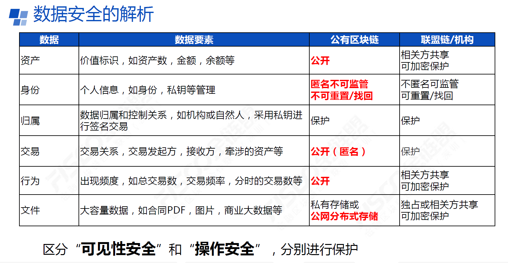
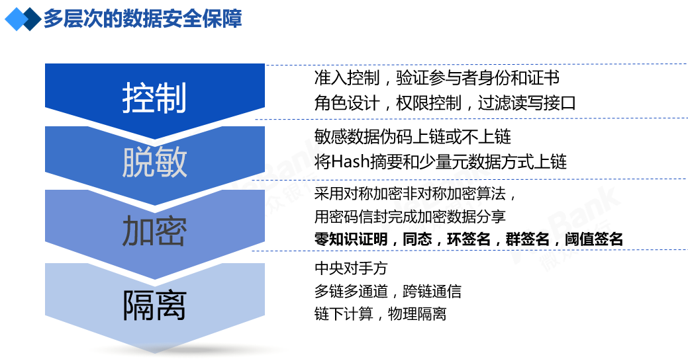
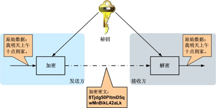
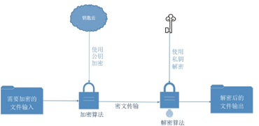

# 第一期 揭秘FISCO BCOS安全架构

**美女学霸工程师**

**揭秘FISCO BCOS安全架构**

**导语：**

【RUN赋能计划】是FISCO BCOS社区发起的系列直播节目，我们希望用便捷趣味的方式，分享区块链行业热点、FISCO BCOS技术特性和业务实践。我们会定期邀请行业大咖，包括一些在行业内非常具有影响力的案例的负责人以及一线核心工程师来进行分享。这是【RUN赋能计划】系列技术直播的第一期。

 

**主讲人：**

陈宇杰：人称学霸小姐姐，主要负责FISCO-BCOS底层平台特性开发，前期工作偏向于隐私保护方面的算法研究和开发，并将其集成到FISCO-BCOS平台，比如说群签名、环签名；后期可能会稍微偏工程，会参与到群组多账本的特性开发中去。

 

 

### 01 为什么要做安全体系？

 

在揭秘FISCO BCOS安全架构之前，先谈一个前置问题：为什么要做安全体系？

简单地说，就是区块链本身的安全机制满足不了商业级生产的需要，尤其是金融领域的需要。

“区块链”这个概念从中本聪第一次提出，到真正完成商业级生产，其实是存在巨大鸿沟。同时，安全本身也是一种相对的概念，各行业对安全的等级要求不同，尤其是在金融行业，对性能和并发、安全和隐私、以及监管层面等等的要求是非常高的。

为什么这样说呢，我们可以从数据维度拆开看，数据要素包括价值标识，比如资产数、金额、余额这些私有的数据，还有个人信息，数据归属和控制关系，比如你这个人名下有哪些账户，这也是一种数据，还有经常容易被忽略的行为数据，包括交易频率、分时的交易数，比如有几家机构搭了一个链，A和B机构交易，B和C机构交易，A和B每天交易一万次，B和C每天交易一百次，这个其实可以说明很多问题的，比如活跃度，比如关系紧密程度，包括资金来往等等。这也是有很强隐私性的。

 

 

交易频率这个东西，在公链上是公开的，你可以打开比特币的公网浏览器，去看某个账号，哪年哪日哪个时候，做过几笔交易，交易的对方是哪个账号，交易金额多少，完全是可以看到的。除了行为数据，在公链上，如比特币、以太坊，资产也是公开的。因为如果他不公开，没法做到全网的验证。但相对而说，他公开的账户隐匿了个人信息，黑客、恐怖分子都可以开账号在链上进行交易，定位不到这个账号的现实身份，你只能查到他的资金数，你也不知道他是谁，没法对他进行监管。

 

但是这对于很多商业合作场景是难以接受的，商业合作需要保护包括资产、交易关系和出现频度的的隐私，尤其是金融领域，账户身份一定是不能匿名的，匿名没法做监管，没法做KYC。

 

然后大数据，就是大容量数据，公网会提供一些分布式存储，有些是公有存储。有些私密性要求比较高的场景，会要求数据存储在自己的机房，比如银行业，所有的数据，基本上一个原则，就是不出机房。

 

**总之，商业合作，尤其是金融领域的商业合作对安全的要求远远高于互联网或者说公网区块链所说的安全标准。那安全的保护，只用区块链原生的一些办法是做不到的，因此，FISCO BCOS基于区块链原始的机构，进行了大量的设计，实现了多层次的立体安全保障，包括控制、脱敏、加密、隔离这四个层面。**

 

 

### 02 FISCO BCOS是如何保证数据安全的？

 

 

 

FISCO BCOS基于区块链原始的结构，进行了大量的的设计，从控制、脱敏、加密、隔离这四个层面，来实现对安全和隐私的多重保护。

 

#### **控制**

先说控制。FISCO BCOS是属于联盟链，联盟链更多在于解决企业场景中的多主体信任问题，提高商业活动效率。联盟链与公链的区别之一就是有准入控制。节点准入控制是指进入联盟需要审核且身份可验证，目前CA技术已经相对成熟，金融机构多半采用CA。新加入的节点可以验证IP地址、证书等，验证通过后才能发起连接加入联盟链，进行共识或者流通数据。这样就能很大程度上避免由参次不齐的参与者产生的一些问题。

 

FISCO-BCOS区块链节点基于证书链验证，整条证书链包括三级：根证书CA===> 机构证书 ===>节点证书 ， 可以很好支持多机构联盟链准入控制场景；

​      举例子：

​       机构A，B，C构成联盟链，且机构A负责为所有其他被允许加入该链的机构颁发证书，机构D想加入该链，需要以下操作流程：

​       向机构A申请机构证书；

​       搭建节点时，每个节点均要放置机构颁发的有效节点证书，节点间通过节点证书相互认证，无有效节点证书的节点无法建立连接，从而达到了仅有被准入的机构才可加入联盟链；

 

 

用一个日常场景举例，比如，大家一起参加一个线下聚会活动，最后主持人说，我们在坐的一起建一个微信群吧，这样方便后续沟通。然后大家就打开微信面对面建群，这个时候需要输入4位数字的“口令”，这就是一个身份验证。通过这样的验证，你才能参与到这个微信群。

 

除了节点准入之外，FISCO BCOS还有一系列的控制机制来保障安全，包括角色设计和权限控制系统，提供了细粒度权限控制机制，链管理员通过该机制为机构指定账户分配访问合约某些功能的权限，达到权限控制目的。

 

比如，我们在联盟链上我们划分了开发、运营、运维、交易员和监管五种角色，如开发和运维分离是基本运作策略，开发只负责提交代码，链上仅有交易员处理账目或进行资产转换，监管可以叫停业务、冻结账号或暂停智能合约、调用接口来及时干预，具有最高等级的权限。引入权限控制的做法和传统交易系统相似，安全性有所保证

 

另外，还有FISCO-BCOS出块节点注册机制：在系统合约里提供了管理记账节点的工具，仅将节点注册到记账者列表，节点才可作为leader出块；若节点不可信，可调用该工具将其从记账者列表中移除；

 

黑名单机制：在系统合约中添加了证书黑名单管理工具，若节点不可信，链管理员可通过该工具，将其证书添加到证书黑名单，其他节点会拒绝与该不可信节点连接；

 

还是微信加群的例子来作比喻，那么根据角色设计不同的权限，比如超级管理员、管理员和普通群员三种，他们的权限是不一样的。超级管理员可以任命管理员、管理员可以发公告，普通群员就没有这些权限。黑名单就类似发现某个群员被盗号了，经常发三俗广告，这个时候管理员就要踢人了。

 

#### **脱敏**

 

接下来我们说脱敏。高度敏感的数据，转换成伪码上链或者考虑不上链。也可以是用hash摘要或者少量元数据的方式上链。你比如说我用户的身份证不上链，我把他转成一个伪码，但是依旧可以完成身份验证。

 

其实我们在日常生活中很多数据脱敏的例子，比如买火车票，身份证号码那一栏部分数字会打上星号；点个外卖，外卖单上的手机号也会有部分数字打上星号，甚至某些视频或照片上的马赛克也是属于脱敏的一种形式。

 

#### **加密**

加密呢，是指采用对称加密、非对称加密算法、密码信封等等，以及零知识证明，群签名，环签名、阈值签名，这些神奇的新的加密算法来进行加密。

 

o  对称加密

l   保证数据机密性；

l   加密和解密使用同一个秘钥；明文+密钥使用很多复杂的变换加密成密文；密文+密钥，经过很多复杂的逆变换解密成明文；

l   常见的算法包括AES， DES，DES优化算法；相比较而言，AES算法性能更高；

咱们FISCO-BCOS平台的落盘加密特性就使用了对称加密算法；

但对称加密算法有一个问题，就是如何共享对称密钥，比较落后的做法，比如说面对面交换密钥；

更好的解决方法是使用非对称加密算法。

o  非对称加密

l   密钥分为（公钥，私钥），公钥可以共享给别人，私钥则是私密信息；

l   在交换隐私信息场景中，Alice向Bob发送秘密信息时，可以用Bob公钥对消息进行加密，Bob在收到密文后，用私钥解密，获取消息，发送了私密信息时，不泄露任何消息内容；

l   主要应用场景包括：密钥交换，数字签名等；

以太坊和比特币使用的签名算法都是ECDSA

非对称加密和对称加密是可以结合在一起用，有点类似我们现在银行使用的HDS或者SSL这种方式，首先是用非对称加密的方式，先交换对称的、符合长度的一个密钥，双方以后就都用这个密钥来对数，进行加密和解密，这在区块链应用的非常非常多。

 

o    国密

除了对称加密和非对称加密之外，零知识证明、同态加密、环签名、群签名、阈值签名，这些是比较前沿的加密技术，目前零知识证明、同态加密、环签名、群签名已经集成到FISCO BCOS了，大家可以根据场景需要选择使用。安全多方计算、阈值签名等等一系列的密码学算法在紧锣密鼓地研究和开发中，大家可以期待一下下~

国密是由国家密码局颁发的一系列算法标准的总称，对外发布的产品都必须符合国密标准，目前区块链使用的国密标准有SM2,SM3,SM4,国密SSL技术规范。

① 非国密版FISCO-BCOS：节点与节点间、节点与客户端间使用了openssl通信协议，基于ECDHE_ECDSA_with_AES密码学套件，具有前向安全性；

② 国密版FISCO-BCOS：节点与节点：使用符合SSL_VPN标准（国家密码学标准）的SSL通信协议，基于ECDHE_SM3_with_SM4密码学套件，具有前向安全性；节点与客户端：使用openssl通信协议，基于RSA_with_AES密码学套件；

FISCO-BCOS在也通过落盘加密特性保证了数据机密性，将存储于本地磁盘的所有数据加密。

 

#### **隔离**

随着新型技术的出现，如量子计算机，一些密码学算法已经不安全了，所以加密算法都存在理论上被攻破的可能性，但是金融业的数据，可能要求是存五年、十年甚至永久保存的，为了防止数据被攻破，对金融业来说，最彻底的安全保护就是隔离，不把数据发给交易不相干的人。这是我们的一个安全价值观，并不是说否定加密算法或其他的一些措施，金融业对安全的要求确实是极致。

 

### 03 几种新型的加密技术

#### **零知识证明**

零知识证明指的是证明者能够在不向验证者提供任何私密的信息的情况下，使验证者相信某个论断是正确的。有一个小故事，可以帮助我们理解“零知识证明”的原理。

故事讲的是阿里巴巴，有一天被强盗抓住了，强盗向阿里巴巴拷问进入山洞的咒语。面对强盗，阿里巴巴是这么想的：如果我把咒语告诉了他们，他们就会认为我没有价值了，就会杀了我；但如果我死活不说，他们也会认为我没有价值而杀了我。怎样才能做到既让他们确信我知道咒语，但又一丁点咒语内容也不泄露给他们呢？阿里巴巴想了一个好办法，他对强盗说：“你们在离开我一箭远的地方，用弓箭指着我，当你们举起右手我就念咒语打开山洞的石门，举起左手我就念咒语关上石门，如果我做不到或逃跑，你们就用弓箭射死我。”多试了几次之后，强盗们不得不相信了阿里巴巴。

 

这样，阿里巴巴既没有告诉强盗进入山洞石门的咒语，同时又向强盗们证明了，他是知道这个咒语的。这就是零知识证明。

 

FISCO BCOS 开源了可被监管的零知识证明方法，基于零知识证明方法，为用户提供一种保护隐私的、可被所有节点验证的秘密交易框架的同时，为监管者提供解密秘密交易的监管接口。基于这个特性可以实现，真正的匿名转账，并且可以被监管。

 

这里真正的匿名转账，指的是通过零知识证明，能够证明这个转账确实存在，但是完全隐匿转账双方身份，这样能够实现深度的隐私保护。我开个脑洞，想起一个经典的例子，如何证明你妈是你妈，常规路径是到户口所在地开证明，这样必须暴露你妈和你的身份，零知识证明是提供另一种可能，在不查户口，不知道你妈和你是谁的情况下，也能证明你们之间的关系。看起来相当有想象空间啊。

 

#### **群签名和环签名**

群签名和环签名都是签名算法，它们主要用于保护发送交易者的身份信息，相较于零知识证明，性能更高，但无法做到隐匿交易内容。

 

 (1) 群签名算法：

① 多个签名者和群主构成一个群，并持有签名私钥，某个签名者对交易签名后，其他人通过验证交易，仅可知道该签名者所属的群组，但无法得知签名者具体身份信息

② 群签名还具有可追踪性特征，比较适用于监管场景，当要追踪某笔交易发起者身份时，群主可通过该比交易的签名追踪签名者身份信息；

 

(2) 环签名：

类似于群签名，但其不具有可追踪特性。

多个签名者构成一个环，某个签名者对某笔交易进行签名时，会带上其他环成员的公钥信息，其他人通过整个环的所有成员公钥验证环签名的有效性，通过签名，仅可知道该签名者所属的环，但无法追踪具体的签名者身份；

 

这样说起来可能比较绕，举个例子你就明白了，比如在匿名投票场景中，使用环签名，可以确认该投票是有效的（是该群体成员投出），但是无法确认是谁投的；而群签名则只有“群主”，可能是监管机构，可以通过签名追查到是谁签署的。常见的应用场景除了匿名投票，还有拍卖、竞标等。

 

这些都属于隐私加密，隐私加密是我们研究的一个特别难、特别有挑战性的一个方向，它也有实用很强的商业意义，因为所有的商业场景，你再说怎么公开，怎么分享、共享，都是有隐私诉求的，机构和机构之间的隐私，个人和机构之间的隐私，个人信息保护等等。

 

值得注意的是，虽然安全和隐私保护这么重要，但是也不能说是越高越好，安全强度满足场景需要即可。有个不可能三角，说的是安全、规模、效率这三个方面不可兼得。前面提到的零知识证明、环签名群签名，算法非常复杂，效率会低一些。强隐私保护和高性能确实是难以兼得的，但在选择隐私保护方案时，我们会将其与性能做折中，在不损耗太多性能的情况下，提升系统安全性。

 

当然，对于新型的强安全性算法，我们也一直很关注，并考虑将其应用到区块链系统中，已经实现的包括零知识证明、群环签名(群签名算法开销不大，完全可落地于生产环境中)， 持续优化已实现的算法性能；还会持续探索安全多方计算、抗量子攻击密码学等领域。聚合签名、多签、阈值签名也是我们持续关注的领域，引入这些技术可以加固FISCO-BCOS整个平台体系的安全性。

 

 

 

### 有兴趣了解更多的同学可以参考

1、可被监管的零知识证明方法：基于零知识证明方法，为用户提供一种保护隐私的、可被所有节点验证的秘密交易框架的同时，为监管者提供解密秘密交易的监管接口。

-可实现的业务场景：匿名转账的实现和监管。

-[关于该框架的实现及详细操作请见文档](https://git.io/vpjPZ：https://git.io/vpjPZ)

[零知识证明RPC服务](https://github.com/FISCO-BCOS/zkg-tx1to1)

[零知识证明库](https://github.com/FISCO-BCOS/libzkg)

 

 

2、群签名和环签名链上验证功能：使用群签名验证其他人在链上验证签名时，仅可获知签名所属的群组；环签名则是通过AMOP将群签名发送给上链结构；二者皆可保证用户的匿名性。

-可实现的业务场景：拍卖、竞标、匿名投票、匿名存证、匿名交易等场景。

-[关于该框架的实现及详细操作请见文档](https://git.io/vpjPW)

 

\3. FISCO-BCOS支持国密算法:

国密是由国家密码局颁发的一系列算法标准的总称，对外发布的产品都必须符合国密标准，目前区块链使用的国密标准有SM2,SM3,SM4,国密SSL技术规范。

l SM2:国密非对称算法，由公钥、私钥组成，用于签名、验签、加密、解密。

l SM3:国密杂凑算法，用于杂凑运算。

l SM4:国密对称算法，使用相同密钥进行数据加密、解密。

l SSL规范:数据传输，国密密钥交换及数据传输加密标准。

现有客户端发送交易到节点，节点与节点之间共识使用ECDSA，SHA3-256算法。数据落盘加密使用AES算法。节点与节点之间SSL连接使用ECDHE密钥交换算法进行SSL连接。

FISCO-BCOS国密版本使用SM2,SM3算法从客户端发送交易到节点，节点与节点之间共识。数据落盘加密使用SM4算法。节点与节点之间SSL连接使用国密ECC密钥交换算法进行SSL连接。

使用国密算法符合国家密码局标准，安全可靠，达到监管要求。同时，亦可选择使用编译开关打开或关闭国密算法版本。

 

使用说明文档：

[国密版FISCO-BCOS说明文档](https://git.io/f49YW)

[web3sdk支持国密的说明文档](https://git.io/f49Y)

 

 

### 答疑

**丁丁：问环签名群签名对监管者是不是透明的？**

回复:环签名是一种用户完全匿名的签名方式，对监管者是匿名的，除非用户的密钥是由监管机构分发的，否则只能通过一定的逻辑限定签名人的组别和签名次数签名。群签名是可监管的，可以设置监管为群管理员，在有必要的情况下，监管可以通过一些操作获得进行群签名用户的身份。

 

**zhaoj@轨道舱：问对称加密和非对称加密，哪个效率更好些？**

回复:我们一般说加密的效率一方面包括了对明文加密和解密的速度，但是这都是针对加解密阶段来说的。另一方加密的效率也包括加密方法的密钥生成，密钥协商阶段等。对称加密的一大缺点是密钥的管理与分配，换句话说，如何把密钥发送到需要解密你的消息的人的手里是一个问题。在发送密钥的过程中，密钥有很大的风险会被黑客们拦截。现实中通常的做法是将对称加密的密钥进行非对称加密，然后传送给需要它的人。

 

假设场景是当Alice希望将文件加密发送给 Bob

针对于对称加密，Alice需要采用各种方式把密钥k安全的传递给Bob，然后用k对明文进行加密算法，再将加密后的密文e传递给Bob。Bob收到密文e后用k进行解密。

 

如果采用非对称加密。首先Alice需要去公开密钥的管理服务器查找 Bob 的公钥，然后找到 Bob 公钥对应的加密算法。Alice 在确定这个公钥的正确性之 后，用 Bob 的公钥对文件进行加密，将加密后的数据发送给 Bob。

当 Bob 收到 Alice 发送的加密文件之后，Bob 使用自己的私钥和解密算法对文件 进行解密，从而得到解密后的文件。

 

其实对称加密效率更高，所以主要用于大容量数据加密场景，非对称加密安全性和密钥长度有关，性能相对较差，主要基于一些难题构造的算法，常见的包括RSA，DSA，ElGamal，ECDSA等，主要运用在数字签名和密钥交换领域，前者用来验证签名者信息，有防篡改功能，后者用来交换秘密信息，如对称密钥，对称加密算法一般基于复杂的变换构造，安全性和密钥长度和变换方法，变换次数有关。

 

 

**wx：问god如果不是节点，那出块节点故意不将god账户的信息出块共识，那不是就是失效了？**

回复:god账号是构造创世区块的必须信息，不设置god账号，或者账号与其他节点不一致，节点就会异常，这种事情，就算是恶意节点也不会想搞死自己

 

**邱明凯：问god毕竟只有一个节点 如果再实际使用中 这个除了故障 系统会出现问题吗**

回复:god是账号，不是节点哈，有创世节点的概念，在pbft共识算法中，如果创世节点异常了，但超过三分之二节点正常，链运行正常

 

 

**王路：问权限控制到合约接口，没有权限的证书身份不能访问，有不有可以直接去节点leveldb的数据库中看合约里的数据？**

回复:权限控制是在底层代码里实现的，不是基于证书的，如果某个账户没有被授予调用合约接口权限，底层就会直接返回无访问权限的异常到客户端，根本无法调用合约

 

**光路：问链管理员由谁承担呢？**

回复:这个需要看具体机构具体角色设计。

 

**王蓓：问新加入的节点D是需要给A\B\C都办法节点证书吗？**

回复:新加入机构要先向链管理员申请机构证书，对应直播中的机构a管理员，机构d的节点证书由机构d管理员颁发。

 

 

 

希望大家多多支持FISCO BCOS【RUN赋能计划】系列技术直播，如果大家觉得不错的话，[欢迎戳这里给我们打星星](https://github.com/FISCO-BCOS/FISCO-BCOS)，也希望大家给我们提提建议，让FISCO BCOS社区变得更好。

 

 

扫码加入官方微信群，与学霸小姐姐交流~

 

 

 
